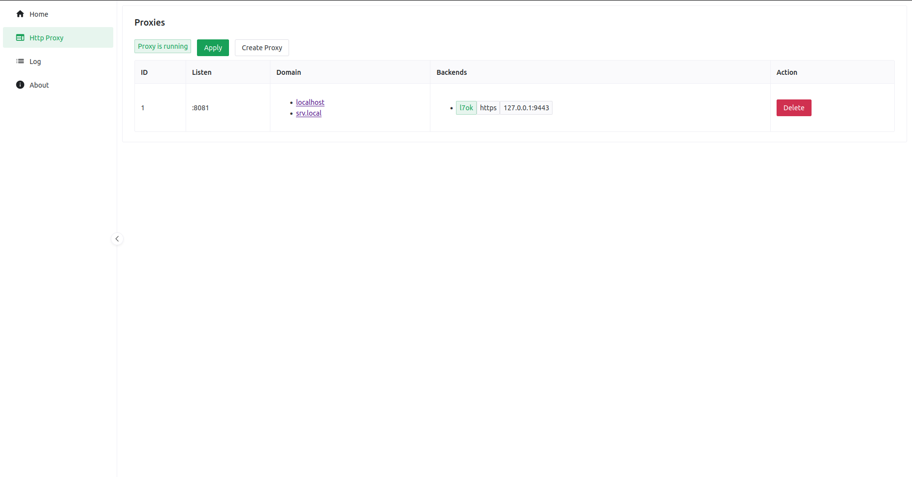

# Haproxy Manager


A simple haproxy manager written in ~~python~~ go.

> This project is still in development and not ready for production use.

## About

Haproxy Manager is a simple admin panel written in go and vue for haproxy. <br>
It is designed to configure haproxy in a simple way over a GUI while providing more features than other alternatives like nginx proxy manager.

## Features

- Supporting multiple backends with load balancing.
- Supporting self-signed certificates for backends.
- Supporting multiple Domains for a single backend.
- Supporting Rate Limits.
- Supporting Bandwidth Limits.
- Supporting Health Checks.

## Installation

### Prerequisites

- Docker

### Docker Run
```sh
docker run -d --name haproxymngr \
  --network host \
  -v haproxymngr:/app/data \
  -e ADDR=0.0.0.0:8080 \
  kirari04/haproxymngr:latest
```

Now you can access the admin panel at `https://localhost:8080`.

### Docker Compose
```yaml
services:
  haproxymngr:
    image: kirari04/haproxymngr:latest
    network_mode: host
    volumes:
      - haproxymngr:/app/data
    environment:
      - ADDR=0.0.0.0:8080
volumes:
  haproxymngr:
```
Now you can access the admin panel at `https://localhost:8080`.

## Screenshots


